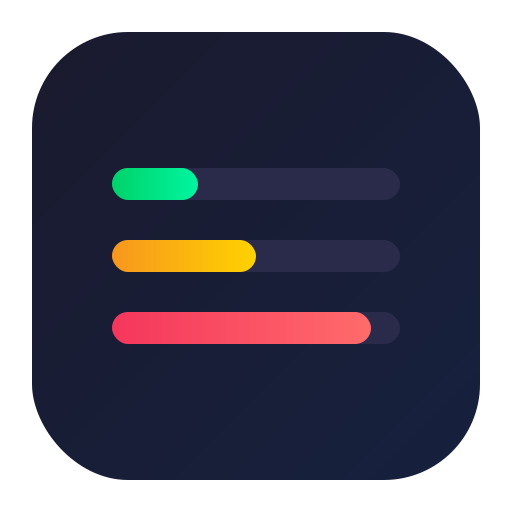
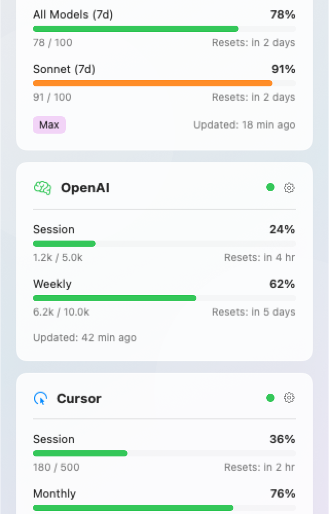
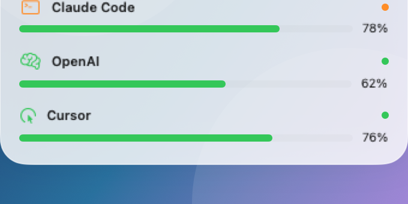

<p align="center">
  
</p>

<h1 align="center">Quota Guard</h1>

<p align="center">
  <strong>Track your AI coding assistant usage limits from the menu bar</strong>
</p>

<p align="center">
  
  
  
  
</p>

<p align="center">
  
</p>

---

> **Note**: Quota Guard is currently in active development. The app is not yet available on the Mac App Store but will be published soon. For now, you can build from source or download pre-built binaries from the Releases page.

A lightweight macOS menu bar app that monitors Claude Code, Codex CLI, and Cursor usage at a glance.

## Screenshots

<p align="center">
  
  &nbsp;&nbsp;&nbsp;
  
</p>

## Features

- **Menu Bar App**: Quick access to usage data from your menu bar
- **Widget Support**: macOS widget for at-a-glance monitoring
- **Multi-Service Support**: Track Claude Code, Codex CLI, and Cursor
- **Zero Configuration**: Automatically reads credentials from CLI tools (no API keys needed)
- **Real-time Updates**: Background refresh every 15 minutes
- **Accordion UI**: Collapsible cards show compact progress bars
- **Color-coded Status**: Green (good), Yellow (warning), Red (critical)

## Supported Services

| Service | Auth Method | Metrics Tracked |
|---------|-------------|-----------------|
| **Claude Code** | OAuth token from `claude login` | 5h session, 7-day all models, 7-day Sonnet |
| **Codex CLI** | OAuth token from `codex login` | 5h limit, weekly limit, code review |
| **Cursor** | Local SQLite database | Monthly usage |

## Installation

### Homebrew (Recommended)

```bash
brew tap shipshitdev/tap
brew install --cask quotaguard
```

To update:
```bash
brew upgrade --cask quotaguard
```

### Manual Download

Download the latest release from the [Releases](https://github.com/shipshitdev/quotaguardapp/releases) page.

> **Note**: Since the app isn't notarized, you may need to right-click and select "Open" the first time, or run:
> ```bash
> xattr -cr /Applications/QuotaGuard.app
> ```

### Build from Source

Prerequisites: macOS 13.0+, Xcode 15.0+

```bash
git clone https://github.com/shipshitdev/quotaguardapp.git
cd quotaguardapp
open QuotaGuard.xcodeproj
# Build and run (Cmd+R)
```

## Setup

### Claude Code

1. Install Claude Code CLI: `npm install -g @anthropic-ai/claude-code`
2. Log in: `claude login`
3. The app automatically reads credentials from `~/.claude/`

### Codex CLI

1. Install Codex CLI: `npm install -g @openai/codex`
2. Log in: `codex login`
3. Select your team/workspace when prompted
4. The app automatically reads credentials from `~/.codex/auth.json`

### Cursor

1. Install and log into Cursor IDE
2. The app automatically reads from Cursor's local database

## Usage

1. **Launch the app** - It appears in your menu bar
2. **Click the icon** - See all your usage metrics
3. **Click a card header** - Expand/collapse to see details
4. **Refresh** - Click the refresh icon to update metrics

### Understanding the Display

**Collapsed view**: Shows service name + compact progress bar for quick status

**Expanded view**: Shows detailed metrics:
- Usage percentage and progress bar
- Reset time (when limits refresh)
- Subscription type badge

### Status Colors

| Color | Meaning |
|-------|---------|
| Green | < 50% used - plenty remaining |
| Yellow | 50-80% used - approaching limit |
| Red | > 80% used - near or at limit |

## CLI Tool

Quota Guard includes a command-line tool for scripts and automation.

```bash
# Show current usage
quotaguard usage

# JSON output for scripts
quotaguard usage --json

# Filter by provider
quotaguard usage --provider claude

# Show token costs (last 30 days)
quotaguard cost

# Cost for specific period
quotaguard cost --days 7 --json
```

The CLI is automatically installed when using Homebrew. For manual installs, it's located at:
```
/Applications/Quota Guard.app/Contents/Helpers/quotaguard
```

## How It Works

Quota Guard reads authentication tokens from local files created by CLI tools:

```
~/.claude.ai/            # Claude Code OAuth
~/.codex/auth.json       # Codex CLI OAuth
~/Library/Application Support/Cursor/  # Cursor local DB
```

It then calls the respective APIs to fetch current usage data:
- Claude: `https://api.anthropic.com/settings/usage`
- Codex: `https://chatgpt.com/backend-api/wham/usage`
- Cursor: Local SQLite queries

**No API keys are stored** - the app uses the same OAuth tokens as the CLI tools.

## Privacy & Security

- All credentials remain in their original locations (managed by CLI tools)
- No data sent to external servers (only official API calls)
- Sandboxed app with minimal file system access
- Open source for full transparency

## Architecture

- **SwiftUI** - Modern declarative UI
- **Combine** - Reactive data flow
- **App Sandbox** - Secure with specific entitlements for credential access
- **URLSession** - Native networking

## Troubleshooting

### "Not configured" for a service

Make sure you're logged into the CLI tool:
```bash
claude login   # For Claude Code
codex login    # For Codex CLI
```

### Codex showing "Free" instead of Team

Run `codex logout && codex login` and select your team workspace when prompted.

### App can't read credentials

The app needs sandbox exceptions to read CLI credential files. Rebuild from source if using a modified entitlements file.

## Contributing

Contributions welcome! Please open an issue first to discuss changes.

## License

MIT License - see [LICENSE](LICENSE) for details.
